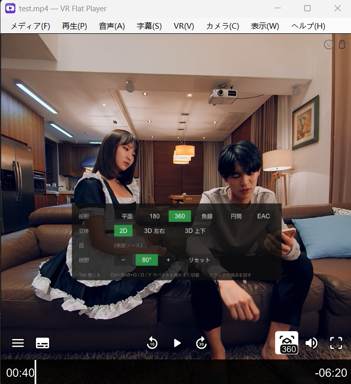

# VR Flat Player

[English](README.md) · [简体中文](README.zh-CN.md) · **日本語** · [한국어](README.ko.md)


**180° / 360° の VR 動画を、普通のフラットモニターで**快適に見るためのデスクトップ
プレイヤーです。ローカルの 8K にも対応します。市販のウェブカメラで、頭の動きに合わせて
視点を動かすことも、手のジェスチャーで再生・シーク・音量・ファイル切り替えを操作する
こともできます。どちらも既定はオフです。

バージョン 0.4、Windows 専用。



*Tab で開くモードパネルと、下部の uosc コントロールバー。*

デコードと描画は mpv + mpv360 が担当し、このリポジトリはプレイヤーのウィンドウと、
両者をつなぐトラッキングブリッジです。

```
                          VRFlatPlayer.exe
  ┌─────────────────────────────────────────────────────────┐
  │  メディア 再生 音声 字幕 VR 表示 ヘルプ                 │
  ├─────────────────────────────────────────────────────────┤
  │                                                         │
  │   mpv のウィンドウ (--wid 子ウィンドウ、別プロセス)     │
  │     mpv360 投影シェーダー · uosc バー · モードパネル    │
  │                                                         │
  └─────────────────────────────────────────────────────────┘
        ▲                                    ▲
        │ JSON IPC                           │ 左ドラッグ (Win32 で直接取得)
        │                                    │
   ┌────┴─────────────────────────────────────┴────┐
   │  ブリッジ: One Euro フィルタ / ゲイン / 再センタリング │
   └───────────────────────┬───────────────────────┘
                           │ UDP (任意)
                  opentrack ◄── webcam
```

## できること

- **180 / 360 / 魚眼 / 円筒 / EAC**、モノラルまたはステレオ、左右または上下配置。
  表示するのは片目だけです — フラットモニターに視点はひとつしかありません。
- **レイアウトの自動判別**。まずファイル名(主要な VR プレイヤー 3 本が確立した命名規則)、
  手がかりがなければ画面の縦横比で判断します。2:1 だけは本質的に判別不能で —
  モノラル 360 と VR180 左右配置はピクセル単位で同一です — そのため選択は
  **ファイルごとに記憶**され、メニューからいつでも直せます。
- **ウェブカメラによる頭部トラッキング**(既定はオフ)。YuNet が顔を見つけ、
  68 点のランドマーカーが位置を求め、PnP が頭部姿勢に変換します。マーカーも
  追加機材も opentrack のインストールも不要です。すでに opentrack を使っているなら
  UDP 入力もそのまま使えます。
- **手のジェスチャー操作**、既定はオフ。手のひらを開いてカメラの前で 1 秒静止すると
  ジェスチャーモードに入り、握りこぶしで再生/一時停止、人差し指でシーク、親指で音量、
  開いた手のひらを横に振るとファイル切り替えです。ジェスチャーモードの外では何も
  反応せず、モード中はヘッドトラッキングが一時停止します。
- **ドラッグで視点移動**、キーボードでの視点移動、ホイールでズーム。
- **ネイティブのメニューバー**(映像に重ねるオーバーレイではありません)。英語・
  簡体字・繁体字・日本語・韓国語に対応し、OS の言語に従います。

## 動作環境

- Windows 10 / 11、x64
- Direct3D 11 が動く GPU(メニューから Vulkan と OpenGL にも切り替え可能)
- 頭部トラッキング: 任意のウェブカメラ
- 8K 再生には比較的新しい単体 GPU が必要です

## インストール

リリースの zip を任意の場所に展開し、`VRFlatPlayer.exe` を実行するだけです。
インストール処理はなく、フォルダーの外には何も書き込みません。

エクスプローラーの「プログラムから開く」に追加するには、同じフォルダーの
`register-file-types.bat` を実行します。取り消しは `unregister-file-types.bat` です。
どちらも **HKEY_CURRENT_USER にのみ書き込む**ため、管理者権限は要りません。

## ソースからのビルド

```
git clone <このリポジトリ>
cd VRHeadTrackingPlayer

tools\install-mpv360.bat      # mpv360 シェーダー、uosc、フォント
tools\install-models.bat      # 4 つの ONNX モデル

dotnet run --project tests/VideoFormatTests/VideoFormatTests.csproj -c Release
powershell -ExecutionPolicy Bypass -File tools/publish.ps1
```

`publish.ps1` は `dist\VR Flat Player\` とバージョン付きの zip を作ります。同梱する
mpv.exe が必要で、インストール済みのものを探すか `-MpvExe <パス>` で指定します。

ビルドには .NET 8 SDK が必要です。生成される exe は自己完結型なので、
**利用者側に .NET は不要**です。

### ONNX モデルはこのリポジトリに含まれていません

頭部トラッキングとジェスチャー操作には合わせて 4 つのモデル(合計約 21 MB)が必要です。
**コミットしていません** — バイナリをソース履歴に入れるべきではなく、4 つとも別の場所で
各自のライセンスのもとに公開されているためです。`tools\install-models.bat` が
`models\` へ取得します。

| ファイル | モデル | 用途 | 取得元 | ライセンス |
| --- | --- | --- | --- | --- |
| `face_detection_yunet.onnx` | YuNet | 頭部 | [opencv/opencv_zoo](https://media.githubusercontent.com/media/opencv/opencv_zoo/main/models/face_detection_yunet/face_detection_yunet_2023mar.onnx) | MIT |
| `face_landmark_peppa_wutz.onnx` | peppa_wutz 68 点 | 頭部 | [facefusion/facefusion-assets](https://github.com/facefusion/facefusion-assets/releases/download/models-3.0.0/peppa_wutz.onnx) | MIT |
| `palm_detection_mediapipe.onnx` | MediaPipe BlazePalm | 手 | [opencv/opencv_zoo](https://media.githubusercontent.com/media/opencv/opencv_zoo/main/models/palm_detection_mediapipe/palm_detection_mediapipe_2023feb.onnx) | Apache 2.0 |
| `handpose_estimation_mediapipe.onnx` | MediaPipe 手の 21 点 | 手 | [opencv/opencv_zoo](https://media.githubusercontent.com/media/opencv/opencv_zoo/main/models/handpose_estimation_mediapipe/handpose_estimation_mediapipe_2023feb.onnx) | Apache 2.0 |

なくてもプレイヤーは動作します。頭部トラッキングとジェスチャー操作だけが使えません。
2 つの機能は独立しているので、片方のペアだけでもその機能は使えます。

### mpv も含まれていません

mpv は独立した GPL のプログラムで、リンクするのではなく**別プロセスとして**
リリースに同梱しています。リポジトリにあるのは `mpv/` 以下の自前の設定と
スクリプトだけです — `mpv.conf`、`input.conf`、`vrmenu.lua`、および
`mpv/shaders-src/` にある mpv360 シェーダーのフォーク。

上流由来のもの — `mpv.exe`、`mpv360.lua`、uosc、フォント、コンパイル済みシェーダー —
はすべて `tools\install-mpv360.bat` が取得し、git では無視されます。

## キー操作

| キー | 動作 |
| --- | --- |
| `Home` | **再センタリング** — 今の頭の向きを新しい正面にする |
| `Alt` + 方向キー | 視点移動、1 回 5° |
| ホイール | 視野角、1 ノッチ 5° |
| 左ドラッグ | 視点移動 |
| `Tab` | モードパネル |
| `Ctrl+E` | 360 モードの切り替え |
| `Ctrl+Shift+P` | 投影方式の巡回 |
| `Ctrl+Shift+E` | 左右の目を入れ替え |
| `Ctrl+Shift+↑ / ↓` | 視野角、1 回 5° |
| `Ctrl+0` / ホイール押し込み | 視野角を 80° に戻す |
| `0` / `9` / Shift+ホイール | 音量を上げる / 下げる |
| `3` / `4` | 暗く / 明るく |
| `1` / `2` | コントラストを下げる / 上げる |
| `Ctrl+Shift+V` | 頭の基準を変えずに視点だけリセット |
| `Ctrl+Shift+H` | 頭部トラッキングの切り替え |
| `Ctrl+Shift+W` | ジェスチャー操作の切り替え |
| `Ctrl+[` / `Ctrl+]` | トラッキングのゲイン − / + |
| `Ctrl+Shift+I` | 再生統計 |
| `F` | 全画面 |

mpv 本来のキー(スペース、方向キー、音量)もそのまま使えます。

## 手のジェスチャー

既定はオフです。**カメラ ▸ ジェスチャー操作**、または `Ctrl+Shift+W` で有効にします。
有効にしてもカメラが見はじめるだけで、ジェスチャーモードに入るまで何も動きません。

**手のひらを開いてカメラの前で 1 秒静止**するとジェスチャーモードに入り、もう一度
同じ動作で抜けます。モード中は**ヘッドトラッキングが一時停止**します。手を振れば頭も
動くので、そのあいだ画面が振り回されるくらいなら視点制御はない方がましだからです。
隅の顔アイコンが琥珀色になって、それを示します。

| ジェスチャー | 通常の動画 | VR 動画 |
| --- | --- | --- |
| 握りこぶし | 再生 / 一時停止 | 再生 / 一時停止 |
| 人差し指を左 / 右 | 10 秒戻す / 10 秒進める | 10 秒戻す / 10 秒進める |
| 親指を上 / 下 | 音量を上げる / 下げる | 視野を狭く / 広く |
| 開いた手のひらを左 / 右へ振る | 前 / 次のファイル | 前 / 次のファイル |

この一覧は、ジェスチャーモードの間ずっと画面右側に 1 行ずつ表示されます。

各ジェスチャーは 0.25 秒ほど静止させます。親指と人差し指は出したままで連続して効きます
(音量・視野・シークはいずれも調整量です)。再生/一時停止とファイル切り替えは 1 回だけ
効いて、もう一度出すには一度その形をやめる必要があります。シークの連続だけは他より
ゆっくりです。1 回が 5 段階の音量ではなく 10 秒の映像なので、同じ速さでは狙った場所を
通り過ぎてしまいます。
手が 5 秒間写らないとジェスチャーモードは自動的に終了します。

振る動作は**静止した状態から始めて**、手のひら 1 個分を横に動かし、1 秒以内に終える
必要があります。静止から始める決まりは、ゆっくり流れる手が勝手にファイルを切り替えて
しまうのを防ぐためで、同時に次の切り替えまでの間合いにもなります。手を戻し、一度止めて、
また振ってください。

ジェスチャー操作が有効なあいだ、手が写ると**右下に小さなパネル**が出て、カメラが読んだ
21 個のランドマークと、手のひら静止の進み具合を示すバーが表示されます。ヘッドトラッキング
には映像そのものという手応えがありますが、ジェスチャーは何か起きるまで画面が変わらず、
「ポーズが認識されない」「手が画面の外にある」「カメラが開いていない」が見分けられません。
このパネルはそれを分けるためのものです。左上にはさらに 2 つの注意が出ます。手が画面の端に
近づいたときと、しばらく見ていて一度も手が見つからないとき(たいていはカメラの向きが高すぎるか、
部屋が暗すぎます)です。

`VRFlatPlayer --gesture-preview` で 21 個のランドマーク、読み取られたポーズ、そして
どの指が伸びていると判定されたかを表示できます。ジェスチャーが効かないときは、
最後のそれが理由を教えてくれます。

## 設定

`bridge.config.json` は exe と同じ場所にあり、メニューで設定を変えると書き込まれます。
削除すれば既定値に戻ります。`VRFlatPlayer.exe --config=path.json --write-config` で
新しいものを生成できます。

知っておく価値のある項目:

| 設定 | 既定値 | 意味 |
| --- | --- | --- |
| `yaw.outputRangeDegrees` | 70 | 首を振り切ったときに視点が回る角度 |
| `yaw.stickyDegrees` | 1.0 | これ以内の頭の動きでは画面が全く動かない |
| `pitch.inputRangeDegrees` | 12 | 人は首を横に振るほど上下には振らない |
| `video.fallback` | `vr180` | 手がかりのない 2:1 ファイルの既定 |
| `filter.glideMaxSeconds` | 0.30 | ポーズの間隔が広いときにグライドを伸ばせる上限。遅いマシンで滑らかに動くか階段状になるかはこれで決まる。`glideSeconds` と同じ値にすれば固定グライドに戻る |
| `source.camera.landmarkFps` | 30 | ランドマーカーの毎秒実行回数の上限 |
| `source.camera.detectWidth` | 640 | 顔検出器に渡す横幅。0 でフレーム全体。1280 の 5 分の 1 のコストで、枠の使い勝手は変わらない |
| `source.camera.detectFps` | 2 | 顔を追跡中に顔検出器を再実行する頻度（Hz）。検出器の答えはフレーム間でほとんど変わりません。毎フレーム必要なのは 68 点モデルの方です。`detectWidth` より先にこちらを |
| `source.camera.width` / `height` | 1280 / 720 | 撮影解像度。**カメラ ▸ カメラ解像度**でも変えられます。顔の画素が多いほど姿勢のノイズが減りますが、`detectWidth` が検出器の見る大きさを押さえるので検出自体は良くなりません |
| `source.camera.trackingCpuShare` | 0.75 | トラッキング全体が使ってよい時間の割合。下げれば CPU は減るが、頭の動きに映像が追従するまでの遅れが同じ倍率で増える |
| `source.camera.gesture.idleFps` | 3 | ジェスチャーモードでないときに手を見る頻度。使っていないあいだのコストそのもので(本機で約 5%/コア)、まず下げるならここ |
| `source.camera.gesture.toggleSeconds` | 1.0 | ジェスチャーモードの出入りに手のひらを静止させる秒数 |
| `source.camera.gesture.swipeTravelPalms` | 1.0 | 振る動作に必要な移動量。ピクセルではなく手のひら幅なので距離が変わっても同じ。実際にどこまで届いたかはログに出ます |
| `source.camera.gesture.seekRepeatSeconds` | 0.8 | シークを出したままにしたときの繰り返し間隔。1 回の幅が大きいので `repeatSeconds` とは別 |

ウィンドウの位置、ファイルごとの VR モード、実行ログはそれぞれ
`window-state.json`、`mode-memory.json`、`mpv-last-run.log` に分けてあります。
**分けているのは意図的**で、ひとつ消しても他は消えません。

## うまく動かないとき

exe の隣の `mpv-last-run.log` に 1 回分の実行が入っています。プレイヤー自身の起動
診断と mpv の出力が**時系列で交ざった**ものです。どの VR モードを**なぜ**選んだか、
ファイルの解像度とコーデック、実際に使われたデコーダーと描画方式、そして
**mpv が最終的にどう設定されたか**が記録されており、判別の誤りか描画の誤りかを
切り分けるにはたいてい十分です。

映像が真っ黒なら「再生 → レンダラー」を変えてください。既定のバックエンドを
動かせないドライバーが最有力の原因です。

## ディレクトリ構成

```
src/HeadTrackBridge/     プレイヤー本体: ウィンドウ、メニュー、IPC、追跡、写像
  Host/                  WinForms のウィンドウとメニューバー
  Mpv/                   IPC クライアント、モード制御、形式判別
  Tracking/              カメラ、ランドマーク、姿勢推定
  Mapping/               フィルタ、ゲイン曲線、視点合成
mpv/                     自前の mpv 設定、スクリプト、シェーダーのソース
tests/VideoFormatTests/  628 個のアサーション、数秒で完走
tools/                   インストールスクリプト、アイコン生成、パッケージング
prompt/                  開発の引き継ぎ記録(中国語)
```

`AGENTS.md` はこのリポジトリの作業規則です。**どの項目も実際に時間を失って
得られたもの**です。

## ライセンスと謝辞

このプレイヤーは **GNU General Public License v3.0 以降**のもとで公開される
フリーソフトウェアです。[LICENSE](LICENSE) を参照してください。

寛容なライセンスではなく GPLv3 なのは、リリースに mpv を同梱しているためです。
mpv は GPLv2 **以降**で、その「以降」が両者を両立させています。本プレイヤーも
同じ条件にすることで、配布物全体の権利関係が曖昧になりません。

以下の成果の上に成り立っています:

- **[mpv](https://mpv.io/)** (GPLv2+) — デコード、描画、再生。**独立した実行ファイル**
  として無改変で同梱しています。
- **[mpv360](https://github.com/kasper93/mpv360)** (MIT) — 投影シェーダー。当方の
  フォークで左右配置のステレオ 360 とモノラル魚眼を追加し、ソース解像度ではなく
  出力解像度で描画するようにしています。
- **[uosc](https://github.com/tomasklaen/uosc)** (LGPL-2.1) — コントロールバー。
- **[YuNet](https://github.com/opencv/opencv_zoo)** (MIT) — 顔検出。
- **peppa_wutz** (MIT) — 68 点ランドマーク。
- **One Euro Filter** — Casiez, Roussel, Vogel、CHI 2012。
- **[opentrack](https://github.com/opentrack/opentrack)** — 任意の UDP 入力元。
