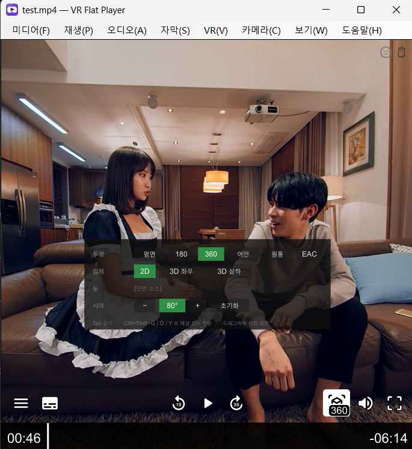

# VR Flat Player

[English](README.md) · [简体中文](README.zh-CN.md) · [日本語](README.ja.md) · **한국어**


**180° / 360° VR 영상을 일반 평면 모니터에서** 편하게 보기 위한 데스크톱
플레이어입니다. 로컬 8K도 재생합니다. 일반 웹캠으로 머리 움직임을 추적해 시야를
자동으로 돌릴 수도 있습니다.

버전 0.3, Windows 전용.



*Tab으로 여는 모드 패널과 아래쪽 uosc 컨트롤 바.*

디코딩과 렌더링은 mpv + mpv360이 맡고, 이 저장소는 플레이어 창과 둘 사이의 추적
브리지입니다.

```
                          VRFlatPlayer.exe
  ┌─────────────────────────────────────────────────────────┐
  │  미디어  재생  오디오  자막  VR  보기  도움말           │
  ├─────────────────────────────────────────────────────────┤
  │                                                         │
  │   mpv 창 (--wid 자식 창, 별도 프로세스)                 │
  │     mpv360 투영 셰이더 · uosc 바 · 모드 패널            │
  │                                                         │
  └─────────────────────────────────────────────────────────┘
        ▲                                    ▲
        │ JSON IPC                           │ 왼쪽 드래그 (Win32 직접 조회)
        │                                    │
   ┌────┴─────────────────────────────────────┴────┐
   │  브리지: One Euro 필터 / 게인 곡선 / 재중심화   │
   └───────────────────────┬───────────────────────┘
                           │ UDP (선택)
                  opentrack ◄── webcam
```

## 무엇을 하는가

- **180 / 360 / 어안 / 원통 / EAC**, 모노 또는 스테레오, 좌우 또는 상하 배치.
  한쪽 눈만 보여줍니다 — 평면 모니터에는 시점이 하나뿐입니다.
- **레이아웃 자동 판별**. 먼저 파일 이름(주요 VR 플레이어 세 종이 정착시킨 명명
  규칙)을 보고, 단서가 없으면 화면 비율로 판단합니다. 2:1만은 본질적으로 구분이
  불가능한데 — 모노 360과 VR180 좌우 배치는 픽셀 단위로 동일합니다 — 그래서 선택은
  **파일마다 기억**되고 메뉴에서 언제든 고칠 수 있습니다.
- **웹캠 머리 추적**(기본 꺼짐). YuNet이 얼굴을 찾고, 68점 랜드마커가 위치를 잡고,
  PnP가 머리 자세로 바꿉니다. 마커도, 추가 장비도, opentrack 설치도 필요 없습니다.
  이미 opentrack을 쓰고 있다면 UDP 입력도 그대로 지원합니다.
- **드래그로 시야 이동**, 키보드 시야 이동, 휠 확대/축소.
- **네이티브 메뉴 바**(영상 위에 겹치는 오버레이가 아닙니다). 영어, 중국어 간체·번체,
  일본어, 한국어를 지원하며 OS 언어를 따릅니다.

## 요구 사항

- Windows 10 / 11, x64
- Direct3D 11이 동작하는 GPU (메뉴에서 Vulkan과 OpenGL로 대체 가능)
- 머리 추적: 아무 웹캠
- 8K 재생에는 비교적 최신 외장 GPU가 필요합니다

## 설치

릴리스 zip을 아무 곳에나 풀고 `VRFlatPlayer.exe`를 실행하면 됩니다. 설치 과정이
없고 폴더 밖에는 아무것도 쓰지 않습니다.

탐색기의 "연결 프로그램"에 추가하려면 같은 폴더의 `register-file-types.bat`을
실행하세요. `unregister-file-types.bat`으로 되돌립니다. 둘 다
**HKEY_CURRENT_USER에만** 쓰므로 관리자 권한이 필요 없습니다.

## 소스에서 빌드

```
git clone <이 저장소>
cd VRHeadTrackingPlayer

tools\install-mpv360.bat      # mpv360 셰이더, uosc, 폰트
tools\install-models.bat      # ONNX 모델 두 개

dotnet run --project tests/VideoFormatTests/VideoFormatTests.csproj -c Release
powershell -ExecutionPolicy Bypass -File tools/publish.ps1
```

`publish.ps1`은 `dist\VR Flat Player\`와 버전이 붙은 zip을 만듭니다. 함께 넣을
mpv.exe가 필요하며, 설치된 것을 찾거나 `-MpvExe <경로>`로 지정합니다.

빌드에는 .NET 8 SDK가 필요합니다. 생성되는 exe는 자체 포함형이라
**사용자에게는 .NET이 필요 없습니다**.

### ONNX 모델은 이 저장소에 없습니다

머리 추적에는 모델 두 개(합쳐서 약 14 MB)가 필요합니다. **커밋하지 않았습니다** —
바이너리는 소스 히스토리에 들어갈 것이 아니고, 둘 다 각자의 라이선스로 다른 곳에
공개되어 있기 때문입니다. `tools\install-models.bat`이 `models\`로 내려받습니다.

| 파일 | 모델 | 출처 | 라이선스 |
| --- | --- | --- | --- |
| `face_detection_yunet.onnx` | YuNet | [opencv/opencv_zoo](https://media.githubusercontent.com/media/opencv/opencv_zoo/main/models/face_detection_yunet/face_detection_yunet_2023mar.onnx) | MIT |
| `face_landmark_peppa_wutz.onnx` | peppa_wutz 68점 | [facefusion/facefusion-assets](https://github.com/facefusion/facefusion-assets/releases/download/models-3.0.0/peppa_wutz.onnx) | MIT |

없어도 플레이어는 정상 동작하며, 머리 추적만 사용할 수 없습니다.

### mpv도 저장소에 없습니다

mpv는 별개의 GPL 프로그램이며, 링크하는 것이 아니라 **별도 프로세스로** 릴리스에
동봉합니다. 저장소에는 `mpv/` 아래의 자체 설정과 스크립트만 있습니다 —
`mpv.conf`, `input.conf`, `vrmenu.lua`, 그리고 `mpv/shaders-src/`의 mpv360 셰이더
포크입니다.

상류에서 가져오는 것 — `mpv.exe`, `mpv360.lua`, uosc, 폰트, 컴파일된 셰이더 —
은 모두 `tools\install-mpv360.bat`이 받아오며 git에서는 무시됩니다.

## 단축키

| 키 | 동작 |
| --- | --- |
| `Home` | **재중심화** — 지금의 머리 자세를 새 정면으로 |
| `Alt` + 방향키 | 시야 이동, 한 번에 5° |
| 마우스 휠 | 시야각, 한 칸 5° |
| 왼쪽 드래그 | 시야 이동 |
| `Tab` | 모드 패널 |
| `Ctrl+E` | 360 모드 켜기/끄기 |
| `Ctrl+Shift+P` | 투영 방식 순환 |
| `Ctrl+Shift+E` | 좌우 눈 교체 |
| `Ctrl+Shift+↑ / ↓` | 시야각, 한 번에 5° |
| `Ctrl+0` / 휠 클릭 | 시야각을 80°로 복원 |
| `0` / `9` / Shift+휠 | 음량 높이기 / 낮추기 |
| `3` / `4` | 어둡게 / 밝게 |
| `1` / `2` | 대비 낮추기 / 높이기 |
| `Ctrl+Shift+V` | 머리 기준은 두고 시야만 초기화 |
| `Ctrl+Shift+H` | 머리 추적 켜기/끄기 |
| `Ctrl+[` / `Ctrl+]` | 추적 게인 − / + |
| `Ctrl+Shift+I` | 재생 통계 |
| `F` | 전체 화면 |

mpv 본래의 키(스페이스, 방향키, 음량)도 그대로 동작합니다.

## 설정

`bridge.config.json`은 exe 옆에 있고 메뉴에서 설정을 바꾸면 기록됩니다. 지우면
기본값으로 돌아갑니다. `VRFlatPlayer.exe --config=path.json --write-config`로 새
파일을 만들 수 있습니다.

알아둘 만한 항목:

| 설정 | 기본값 | 이유 |
| --- | --- | --- |
| `yaw.outputRangeDegrees` | 70 | 고개를 끝까지 돌렸을 때 시야가 도는 각도 |
| `yaw.stickyDegrees` | 1.0 | 이 범위 안의 머리 움직임에는 화면이 전혀 움직이지 않음 |
| `pitch.inputRangeDegrees` | 12 | 사람은 좌우로 돌리는 만큼 위아래로 끄덕이지 않음 |
| `video.fallback` | `vr180` | 단서 없는 2:1 파일을 무엇으로 열지 |
| `filter.glideMaxSeconds` | 0.30 | 포즈 간격이 넓을 때 글라이드를 늘릴 수 있는 상한. 느린 기기에서 부드럽게 움직이는지 계단처럼 끊기는지가 여기서 갈린다. `glideSeconds`와 같은 값으로 두면 고정 글라이드로 돌아간다 |
| `source.camera.landmarkFps` | 30 | 랜드마커의 초당 실행 횟수 상한 |
| `source.camera.detectWidth` | 640 | 얼굴 검출기가 보는 가로 크기. 0이면 전체 프레임. 1280보다 5배 싸고 박스는 그대로 쓸 만하다 |
| `source.camera.trackingCpuShare` | 0.75 | 추적 파이프라인 전체가 쓸 수 있는 시간 비율. 낮추면 CPU는 줄지만 머리 움직임에 화면이 따라오는 지연이 같은 배율로 늘어난다 |

창 위치, 파일별 VR 모드, 실행 로그는 각각 `window-state.json`,
`mode-memory.json`, `mpv-last-run.log`에 나뉘어 있습니다. **나눈 것은 의도적**이며,
하나를 지워도 나머지는 남습니다.

## 문제가 생기면

exe 옆의 `mpv-last-run.log`에 한 번의 실행이 담깁니다. 플레이어 자신의 시작 진단과
mpv의 출력이 **일어난 순서대로 섞여** 있습니다. 어떤 VR 모드를 **왜** 골랐는지,
파일의 해상도와 코덱, 실제로 쓰인 디코더와 렌더러, 그리고 **mpv가 최종적으로 어떤
상태였는지**가 적혀 있어, 판별 실수인지 렌더링 실수인지 가리기에 대개 충분합니다.

화면이 검게 나오면 "재생 → 렌더러"를 바꿔 보세요. 기본 백엔드를 다루지 못하는
드라이버가 가장 흔한 원인입니다.

## 디렉터리 구성

```
src/HeadTrackBridge/     플레이어 본체: 창, 메뉴, IPC, 추적, 매핑
  Host/                  WinForms 창과 메뉴 바
  Mpv/                   IPC 클라이언트, 모드 제어, 형식 판별
  Tracking/              카메라, 랜드마크, 자세 추정
  Mapping/               필터, 게인 곡선, 시야 합성
mpv/                     자체 mpv 설정, 스크립트, 셰이더 소스
tests/VideoFormatTests/  628개 단언, 몇 초면 완료
tools/                   설치 스크립트, 아이콘 생성, 패키징
prompt/                  개발 인수인계 기록(중국어)
```

`AGENTS.md`에는 이 저장소의 작업 규칙이 있습니다. **하나같이 실제로 시간을 잃고
얻은 것들**입니다.

## 라이선스와 감사

이 플레이어는 **GNU General Public License v3.0 이상**을 따르는 자유 소프트웨어입니다. [LICENSE](LICENSE)를 참고하세요.

관대한 라이선스가 아니라 GPLv3인 이유는 릴리스에 mpv를 동봉하기 때문입니다.
mpv는 GPLv2 **이상**이고, 그 "이상"이 둘을 양립하게 합니다. 이 플레이어도 같은
조건을 따르면 배포물 전체의 권리 관계가 모호해지지 않습니다.

다음 성과 위에 서 있습니다:

- **[mpv](https://mpv.io/)** (GPLv2+) — 디코딩, 렌더링, 재생. **별도 실행 파일**로
  수정 없이 동봉합니다.
- **[mpv360](https://github.com/kasper93/mpv360)** (MIT) — 투영 셰이더. 우리 포크는
  좌우 배치 스테레오 360과 모노 어안을 추가하고, 원본 해상도가 아니라 출력 해상도로
  렌더링합니다.
- **[uosc](https://github.com/tomasklaen/uosc)** (LGPL-2.1) — 컨트롤 바.
- **[YuNet](https://github.com/opencv/opencv_zoo)** (MIT) — 얼굴 검출.
- **peppa_wutz** (MIT) — 68점 랜드마크.
- **One Euro Filter** — Casiez, Roussel, Vogel, CHI 2012.
- **[opentrack](https://github.com/opentrack/opentrack)** — 선택적 UDP 입력원.
