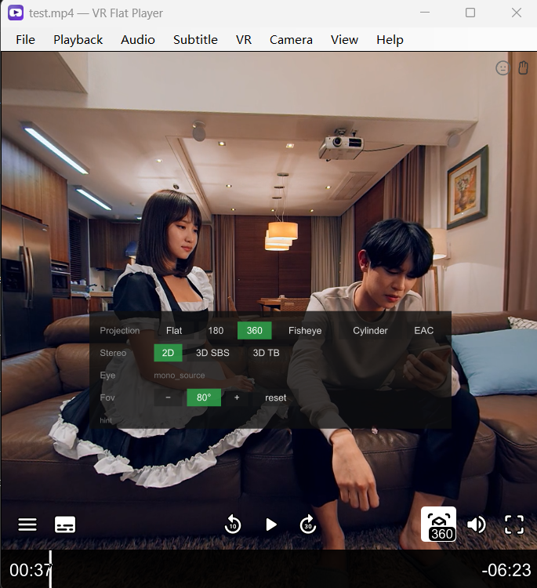

# VR Flat Player

**English** · [简体中文](README.zh-CN.md) · [日本語](README.ja.md) · [한국어](README.ko.md)


A desktop player for watching **180° / 360° VR video on an ordinary flat
monitor**, comfortably, including local 8K. Optionally a plain webcam does two
things: it turns the view as you move your head, and it takes hand gestures for
play, seek, volume and changing file. Both are off by default.

Version 0.4. Windows only.



*The mode panel (Tab) over a VR180 file, with the uosc control bar below.*

Decoding and rendering are mpv + mpv360; this repository is the player window
and the tracking bridge between them.

```
                          VRFlatPlayer.exe
  ┌─────────────────────────────────────────────────────────┐
  │  Media  Playback  Audio  Subtitles  VR  View  Help      │
  ├─────────────────────────────────────────────────────────┤
  │                                                         │
  │   mpv's window  (--wid child, a separate process)       │
  │     mpv360 projection shader · uosc bar · mode panel    │
  │                                                         │
  └─────────────────────────────────────────────────────────┘
        ▲                                    ▲
        │ JSON IPC                           │ left-drag (Win32 mouse polling)
        │                                    │
   ┌────┴─────────────────────────────────────┴────┐
   │  bridge: One Euro filter / gain curve / recentre │
   └───────────────────────┬───────────────────────┘
                           │ UDP (optional)
                  opentrack ◄── webcam
```

## What it does

- **180 / 360 / fisheye / cylindrical / EAC**, mono or stereo, side-by-side or
  over-under. One eye is shown, because a flat monitor has one viewpoint.
- **Detects the layout** from the filename conventions the three common VR
  players established, and from the frame shape when the name says nothing.
  A 2:1 file is genuinely ambiguous — mono 360 and VR180 side-by-side are
  pixel-identical — so the choice is remembered per file and correctable from
  the menu.
- **Webcam head tracking**, off by default. YuNet finds the face, a 68-point
  landmarker locates it, and PnP turns that into a head pose. No markers, no
  extra hardware, no opentrack install required — though opentrack over UDP is
  still supported if you already use it.
- **Hand gestures**, off by default. Hold an open palm at the camera for a
  second to enter gesture mode, then a fist plays and pauses, an index finger
  seeks, a thumb changes volume, and an open palm swept sideways changes file.
  Nothing responds outside gesture mode, and head tracking pauses inside it.
- **Drag to look** with the mouse, keyboard look, wheel to zoom.
- **A native menu bar** rather than an overlay, in English, Simplified and
  Traditional Chinese, Japanese and Korean, following the OS language.

## Requirements

- Windows 10 or 11, x64
- A GPU that can do Direct3D 11 (the menu offers Vulkan and OpenGL as fallbacks)
- For head tracking: any webcam
- 8K playback wants a recent discrete GPU; see the notes on decoder choice

## Install

Download the release zip, unpack it anywhere, run `VRFlatPlayer.exe`. Nothing is
installed and nothing is written outside the folder.

To add the player to Explorer's *Open with* list, run
`register-file-types.bat` from the same folder. `unregister-file-types.bat`
removes it. Both write only under `HKEY_CURRENT_USER`, so no administrator
rights are needed.

## Build from source

```
git clone <this repository>
cd VRHeadTrackingPlayer

tools\install-mpv360.bat      # mpv360 shader, uosc, fonts
tools\install-models.bat      # the four ONNX models

dotnet run --project tests/VideoFormatTests/VideoFormatTests.csproj -c Release
powershell -ExecutionPolicy Bypass -File tools/publish.ps1
```

`publish.ps1` produces `dist\VR Flat Player\` and a versioned zip. It needs an
mpv.exe to bundle and will find one that is installed, or take `-MpvExe <path>`.

.NET 8 SDK is required to build. The published exe is self-contained, so users
do not need .NET.

### The ONNX models are not in this repository

Head tracking and gesture control need four models, together about 21 MB. They
are not committed — binaries do not belong in source history, and all four are
published elsewhere under their own licences. `tools\install-models.bat` fetches
them into `models\`:

| File | Model | For | Source | Licence |
| --- | --- | --- | --- | --- |
| `face_detection_yunet.onnx` | YuNet | head | [opencv/opencv_zoo](https://media.githubusercontent.com/media/opencv/opencv_zoo/main/models/face_detection_yunet/face_detection_yunet_2023mar.onnx) | MIT |
| `face_landmark_peppa_wutz.onnx` | peppa_wutz 68-point landmarker | head | [facefusion/facefusion-assets](https://github.com/facefusion/facefusion-assets/releases/download/models-3.0.0/peppa_wutz.onnx) | MIT |
| `palm_detection_mediapipe.onnx` | MediaPipe BlazePalm | hands | [opencv/opencv_zoo](https://media.githubusercontent.com/media/opencv/opencv_zoo/main/models/palm_detection_mediapipe/palm_detection_mediapipe_2023feb.onnx) | Apache 2.0 |
| `handpose_estimation_mediapipe.onnx` | MediaPipe hand landmarks, 21 points | hands | [opencv/opencv_zoo](https://media.githubusercontent.com/media/opencv/opencv_zoo/main/models/handpose_estimation_mediapipe/handpose_estimation_mediapipe_2023feb.onnx) | Apache 2.0 |

Without them the player still works; only head tracking and gesture control are
unavailable. The two are independent — either pair alone is enough for its own
feature.

### mpv is not in this repository either

mpv is a separate GPL program, bundled with releases rather than linked. The
repository holds only our own configuration and scripts under `mpv/`:
`mpv.conf`, `input.conf`, `vrmenu.lua` and our fork of the mpv360 shader in
`mpv/shaders-src/`.

Everything vendored from upstream — `mpv.exe`, `mpv360.lua`, uosc, fonts, the
compiled shader — is fetched by `tools\install-mpv360.bat` and ignored by git.

## Keys

| Key | Action |
| --- | --- |
| `Home` | Recentre — make the current head pose the new neutral |
| `Alt` + arrows | Look, 5° a press |
| Mouse wheel | Field of view, 5° a notch |
| Left-drag | Look |
| `Tab` | Mode panel |
| `Ctrl+E` | 360 mode on/off |
| `Ctrl+Shift+P` | Cycle projection |
| `Ctrl+Shift+E` | Swap eye |
| `Ctrl+Shift+↑ / ↓` | Field of view, 5° a press |
| `Ctrl+0` / wheel click | Field of view back to 80° |
| `0` / `9` / Shift+wheel | Volume up / down |
| `3` / `4` | Brightness down / up |
| `1` / `2` | Contrast down / up |
| `Ctrl+Shift+V` | Reset the view without moving the head reference |
| `Ctrl+Shift+H` | Head tracking on/off |
| `Ctrl+Shift+W` | Gesture control on/off |
| `Ctrl+[` / `Ctrl+]` | Tracking gain down / up |
| `Ctrl+Shift+I` | Playback statistics |
| `F` | Fullscreen |

Ordinary mpv keys — space, arrows, volume — work as usual.

## Hand gestures

Off by default; switch it on under **Camera ▸ Gesture Control**, or with
`Ctrl+Shift+W`. That only makes the camera watch — nothing acts until you enter
gesture mode.

**Hold an open palm still in front of the camera for a second** to enter gesture
mode, and hold it again to leave. While it is on, head tracking is paused: the
head moves while a hand is being waved about, and a view that swings around
during that is worse than no view control at all. The face icon in the corner
turns amber to say so.

| Gesture | Ordinary video | VR video |
| --- | --- | --- |
| Fist | Play / pause | Play / pause |
| Index finger left / right | Back 10 s / forward 10 s | Back 10 s / forward 10 s |
| Thumb up / down | Volume up / down | Narrower / wider field of view |
| Open palm swept left / right | Previous / next file | Previous / next file |

The list stays on screen, one line per gesture, for as long as gesture mode is
on.

Hold each shape still for about a quarter of a second. The thumb and the index
finger repeat while held, because volume, field of view and seeking are
adjustments; play/pause and changing file fire once and need the hand to leave
the pose first. Seeking repeats more slowly than the other two — its step is ten
seconds of film rather than five units of volume, and at the same rate it scrubs
past whatever you were aiming at.
Gesture mode also ends by itself after five seconds with no hand in view.

A swipe has to start from a hand that is still, cover a palm width, and finish
inside a second. Starting from rest is what stops a hand drifting across the
frame from skipping a file, and it is also the pause between one file change and
the next: bring the hand back, stop for a moment, and swipe again.

While gesture control is on, a small panel appears in the bottom-right corner
whenever your hand is in view, showing the 21 landmarks the camera is reading
and a bar that fills as the palm hold completes. Head tracking has the picture
itself as feedback — turn your head and the view moves — and gestures have
nothing until something fires, which makes "the pose was not recognised", "my
hand is out of frame" and "the camera never opened" look identical. The panel
is there to tell those apart, and two more warnings appear in the top left: one
when your hand reaches the edge of the picture, and one — said once — if the
camera has been watching for a while and has never found a hand at all, which
usually means it is aimed too high or the room is too dark.

Run `VRFlatPlayer --gesture-preview` for the full diagnostic: the same landmarks
plus the pose that was read and which fingers it counted as out. When a gesture
will not register, that last one is what says why.

## Configuration

`bridge.config.json` sits next to the exe and is written as you change settings
in the menus. Deleting it restores the defaults. A fresh copy can be produced
with `VRFlatPlayer.exe --config=path.json --write-config`.

The values worth knowing:

| Setting | Default | Why |
| --- | --- | --- |
| `yaw.outputRangeDegrees` | 70 | View degrees at full head turn |
| `yaw.stickyDegrees` | 1.0 | Head movement ignored before the view follows |
| `pitch.inputRangeDegrees` | 12 | People pitch their head far less than they turn it |
| `video.fallback` | `vr180` | What a 2:1 file with no clues is opened as |
| `filter.glideMaxSeconds` | 0.30 | How far the glide may stretch when poses arrive slowly. This is what keeps a slow tracker looking smooth instead of stepped; set it equal to `glideSeconds` for a fixed glide |
| `source.camera.landmarkFps` | 30 | Upper bound on landmark runs per second |
| `source.camera.detectWidth` | 640 | Width the face detector sees; 0 detects on the full frame. Five times cheaper than 1280 and the box is just as usable |
| `source.camera.detectFps` | 2 | How often the face detector re-runs while the landmarker is following a face. The detector answers “where is the face” and that barely changes between frames; the 68-point model is the one that has to run every frame. Try this before `detectWidth` — it costs nothing in what the detector can see |
| `source.camera.width` / `height` | 1280 / 720 | Capture resolution, also on the **Camera ▸ Camera Resolution** menu. More pixels on the face means less pose noise, which is what matters if you sit well back; it does *not* make detection any better on its own, because `detectWidth` caps what the detector sees. A camera without the mode you pick quietly gives you its nearest one, and the log says so |
| `source.camera.trackingCpuShare` | 0.75 | Share of wall time the whole tracking pipeline may use. Lower it to spend less CPU — it multiplies the delay before the view answers your head by the same factor |
| `source.camera.gesture.idleFps` | 3 | How often the hand is looked at while gesture mode is off. This is what gesture control costs while you are not using it — about 5% of a core here — and the first number to lower |
| `source.camera.gesture.toggleSeconds` | 1.0 | How long an open palm must be held still to enter or leave gesture mode |
| `source.camera.gesture.swipeTravelPalms` | 1.0 | How far a swipe must travel, in palm widths rather than pixels, so it means the same at a desk and at arm’s length. The log prints the furthest your own hand actually reached |
| `source.camera.gesture.seekRepeatSeconds` | 0.8 | How often a held seek repeats. Separate from `repeatSeconds` because its step is far larger |

Window position, per-file VR modes and the run log are kept in separate files
(`window-state.json`, `mode-memory.json`, `mpv-last-run.log`) so that clearing
one does not clear the others.

## Troubleshooting

`mpv-last-run.log`, next to the exe, holds one run: the player's startup
diagnostics and mpv's output interleaved. It records which VR mode was chosen
and why, the file's resolution and codec, the decoder and renderer in use, and
what mpv was actually left set to — which is usually enough to tell a detection
mistake from a rendering one.

If the picture is black, try Playback → Renderer; the likeliest cause is a
driver that cannot do the default backend.

## Project layout

```
src/HeadTrackBridge/     the player: window, menus, IPC, tracking, mapping
  Host/                  WinForms window and menu bar
  Mpv/                   IPC client, mode controller, format detection
  Tracking/              camera, landmarks, pose solving
  Mapping/               filter, gain curve, view composition
mpv/                     our mpv configuration, scripts and shader source
tests/VideoFormatTests/  628 assertions, runs in seconds
tools/                   install scripts, icon generator, publish
prompt/                  development handover notes (Chinese)
```

`AGENTS.md` holds the working rules for this repository, each written down
because breaking it cost real time.

## Licence and credits

This player is free software under the **GNU General Public License v3.0 or
later**. See [LICENSE](LICENSE).

GPLv3 rather than something permissive because releases bundle mpv, which is
GPLv2-or-later: the "or later" is what makes the two compatible, and keeping
this player under the same terms keeps the combined download unambiguous.

It stands on:

- **[mpv](https://mpv.io/)** (GPLv2+) — decoding, rendering, playback. Bundled
  with releases as a separate executable, unmodified.
- **[mpv360](https://github.com/kasper93/mpv360)** (MIT) — the projection
  shader. Our fork adds side-by-side stereo 360 and mono fisheye, and renders
  at output resolution instead of source resolution.
- **[uosc](https://github.com/tomasklaen/uosc)** (LGPL-2.1) — the control bar.
- **[YuNet](https://github.com/opencv/opencv_zoo)** (MIT) — face detection.
- **peppa_wutz** (MIT) — 68-point landmarks.
- **One Euro Filter** — Casiez, Roussel and Vogel, CHI 2012.
- **[opentrack](https://github.com/opentrack/opentrack)** — optional UDP source.
