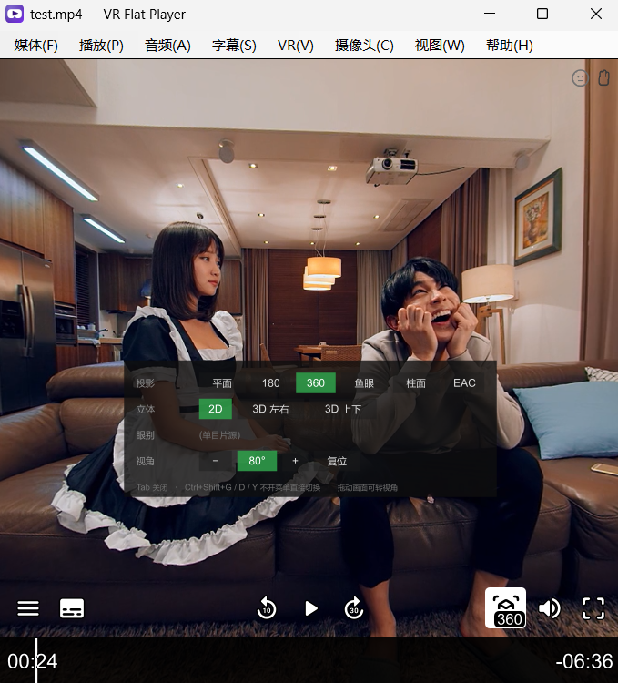

# VR 视频平面播放器

[English](README.md) · **简体中文** · [日本語](README.ja.md) · [한국어](README.ko.md)


在**普通显示器**上舒服地观看 **180° / 360° VR 视频**的桌面播放器,支持本地 8K。
可选用普通摄像头做两件事:跟着头部动作转动视角,以及用手势控制播放、快进快退、音量和
切换文件。两者默认都关闭。

版本 0.4,仅支持 Windows。



*Tab 打开的模式面板，下方是 uosc 控制栏。*

> 英文名 **VR Flat Player**,可执行文件、发布目录和安装路径都用英文名
> (`VRFlatPlayer.exe`、`dist\VR Flat Player\`)—— 路径里避开非 ASCII 字符,
> 省去一整类编码和命令行转义的麻烦。

解码和渲染复用 mpv + mpv360,本仓库提供播放器窗口和中间的追踪桥接层。

```
                          VRFlatPlayer.exe
  ┌─────────────────────────────────────────────────────────┐
  │  媒体  播放  音频  字幕  VR  视图  帮助                 │
  ├─────────────────────────────────────────────────────────┤
  │                                                         │
  │   mpv 的窗口(--wid 子窗口,另一个进程)                 │
  │     mpv360 投影着色器 · uosc 控制栏 · 模式面板          │
  │                                                         │
  └─────────────────────────────────────────────────────────┘
        ▲                                    ▲
        │ JSON IPC                           │ 左键拖动(Win32 直接读鼠标)
        │                                    │
   ┌────┴─────────────────────────────────────┴────┐
   │  桥接层:One Euro 滤波 / 增益曲线 / 回中        │
   └───────────────────────┬───────────────────────┘
                           │ UDP(可选)
                  opentrack ◄── webcam
```

## 能做什么

- **180 / 360 / 鱼眼 / 柱面 / EAC**,单目或立体,左右或上下排列。只显示一只眼睛 ——
  平面显示器只有一个视点。
- **自动识别片源格式**:先看文件名(沿用三个主流 VR 播放器确立的命名约定),
  文件名没线索时看画面比例。2:1 是真正无解的一种 —— 单目 360 和 VR180 左右排列
  在像素上完全一样 —— 所以选择会**按文件记住**,也可以随时从菜单改。
- **摄像头头部追踪**,默认关闭。YuNet 找脸,68 点模型定位,PnP 解算出头部姿态。
  无需标记点、无需额外硬件、无需安装 opentrack —— 但如果你已经在用 opentrack,
  UDP 输入依然支持。
- **摄像头手势控制**,默认关闭。张开手掌对着摄像头静止保持一秒进入手势模式,之后握拳可播放/暂停,食指可快退快进,拇指可调音量,张开手掌左右挥动可切换文件。
  手势模式之外一律不响应;手势模式期间头部追踪会暂停。
- **鼠标拖动转视角**、键盘转视角、滚轮缩放。
- **原生菜单栏**(不是画面上的浮层),支持英文、简繁中文、日文、韩文,跟随系统语言。

## 运行要求

- Windows 10 / 11,x64
- 支持 Direct3D 11 的显卡(菜单里备有 Vulkan 和 OpenGL 作为退路)
- 头部追踪:任意摄像头
- 8K 播放需要较新的独立显卡,解码器选择见下文

## 安装

下载发布包解压到任意位置,运行 `VRFlatPlayer.exe`。不写注册表、不往文件夹外写任何东西。

想让右键"打开方式"里出现这个播放器,运行同目录下的 `register-file-types.bat`,
`unregister-file-types.bat` 可撤销。两者**只写 HKEY_CURRENT_USER**,不需要管理员权限。

## 从源码构建

```
git clone <本仓库>
cd VRHeadTrackingPlayer

tools\install-mpv360.bat      # mpv360 着色器、uosc、字体
tools\install-models.bat      # 四个 ONNX 模型

dotnet run --project tests/VideoFormatTests/VideoFormatTests.csproj -c Release
powershell -ExecutionPolicy Bypass -File tools/publish.ps1
```

`publish.ps1` 产出 `dist\VR Flat Player\` 和带版本号的 zip。它需要一个 mpv.exe 来打包,
会自动找已安装的,也可以用 `-MpvExe <路径>` 指定。

构建需要 .NET 8 SDK。发布出来的 exe 是自包含的,**用户不需要装 .NET**。

### ONNX 模型不在本仓库里

头部追踪和手势控制一共需要四个模型,合计约 21 MB。**没有提交进仓库** —— 二进制不该进
源码历史,而且四个都在别处发布、各有各的许可证。`tools\install-models.bat` 会把它们
下载到 `models\`:

| 文件 | 模型 | 用于 | 来源 | 许可证 |
| --- | --- | --- | --- | --- |
| `face_detection_yunet.onnx` | YuNet | 头部 | [opencv/opencv_zoo](https://media.githubusercontent.com/media/opencv/opencv_zoo/main/models/face_detection_yunet/face_detection_yunet_2023mar.onnx) | MIT |
| `face_landmark_peppa_wutz.onnx` | peppa_wutz 68 点 | 头部 | [facefusion/facefusion-assets](https://github.com/facefusion/facefusion-assets/releases/download/models-3.0.0/peppa_wutz.onnx) | MIT |
| `palm_detection_mediapipe.onnx` | MediaPipe BlazePalm | 手部 | [opencv/opencv_zoo](https://media.githubusercontent.com/media/opencv/opencv_zoo/main/models/palm_detection_mediapipe/palm_detection_mediapipe_2023feb.onnx) | Apache 2.0 |
| `handpose_estimation_mediapipe.onnx` | MediaPipe 21 点手部关键点 | 手部 | [opencv/opencv_zoo](https://media.githubusercontent.com/media/opencv/opencv_zoo/main/models/handpose_estimation_mediapipe/handpose_estimation_mediapipe_2023feb.onnx) | Apache 2.0 |

没有它们播放器照常工作,只是用不了头部追踪和手势控制。两者互不依赖,只装一对也能用
对应的那个功能。

### mpv 同样不在仓库里

mpv 是独立的 GPL 程序,**以独立进程的形式随发布包分发,不是链接进来的**。
仓库里只有我们自己的配置和脚本(`mpv/` 下):`mpv.conf`、`input.conf`、`vrmenu.lua`,
以及我们 fork 的 mpv360 着色器源码 `mpv/shaders-src/`。

所有来自上游的东西 —— `mpv.exe`、`mpv360.lua`、uosc、字体、编译后的着色器 ——
都由 `tools\install-mpv360.bat` 下载,并被 git 忽略。

## 快捷键

| 按键 | 作用 |
| --- | --- |
| `Home` | **视角归正** —— 以当前头部姿态为新的中立位 |
| `Alt` + 方向键 | 转视角,一次 5° |
| 滚轮 | 视场角,一格 5° |
| 左键拖动 | 转视角 |
| `Tab` | 模式面板 |
| `Ctrl+E` | 开关 360 模式 |
| `Ctrl+Shift+P` | 循环投影格式 |
| `Ctrl+Shift+E` | 切换眼别 |
| `Ctrl+Shift+↑ / ↓` | 视场角,一次 5° |
| `Ctrl+0` / 按下滚轮 | 视场角复位到 80° |
| `0` / `9` / Shift+滚轮 | 增大 / 减小音量 |
| `3` / `4` | 调暗 / 调亮 |
| `1` / `2` | 降低 / 提高对比度 |
| `Ctrl+Shift+V` | 视角复位(不改变头部参考) |
| `Ctrl+Shift+H` | 开关头部追踪 |
| `Ctrl+Shift+W` | 开关手势控制 |
| `Ctrl+[` / `Ctrl+]` | 追踪增益 − / + |
| `Ctrl+Shift+I` | 播放统计 |
| `F` | 全屏 |

mpv 原有的按键(空格、方向键、音量)照常可用。

## 手势控制

默认关闭。在**摄像头 ▸ 手势控制**里打开,或按 `Ctrl+Shift+W`。打开只是让摄像头开始
看 —— 在进入手势模式之前,任何手势都不会触发动作。

**张开手掌对着摄像头静止保持一秒**进入手势模式,再保持一次退出。手势模式期间
**头部追踪会暂停**:挥手的时候头也在动,画面跟着乱转比没有视角控制更难受。
角落里的人脸图标会变成琥珀色表示这一点。

| 手势 | 普通视频 | VR 视频 |
| --- | --- | --- |
| 握拳 | 播放 / 暂停 | 播放 / 暂停 |
| 食指指左 / 指右 | 后退 10 秒 / 前进 10 秒 | 后退 10 秒 / 前进 10 秒 |
| 拇指朝上 / 朝下 | 音量增大 / 减小 | 视野变窄 / 变宽 |
| 张开手掌向左 / 向右挥动 | 上一个 / 下一个文件 | 上一个 / 下一个文件 |

手势模式打开期间,这张表会常驻在画面右侧,每种手势一行。

每个手势保持约四分之一秒。拇指和食指长按会连发(音量、视野、快进快退都是调节量);
播放/暂停和切换文件只触发一次,手必须先离开该姿态才能再次触发。快进快退的连发比另外
两个慢:它一步是十秒片长,而不是五格音量,同样的节奏会直接冲过你想找的位置。
画面中五秒没有手时,手势模式也会自动退出。

挥动需要**从静止开始**,横向走过一个掌宽,并在一秒内完成。从静止开始是为了让缓慢漂移
的手不会误切文件,同时它也是两次切换之间的停顿:手收回来、停一下,就可以再挥一次。

手势控制打开后,只要手进入画面,**右下角会出现一个小面板**,画出摄像头读到的 21 个
关键点,以及手掌保持的进度条。头部追踪有画面本身作为反馈——转头画面就动,不动你立刻
知道;手势在触发之前屏幕上什么都不变,于是"姿态没被识别""手不在画面里""摄像头根本
没开"三种情况长得一模一样。这个面板就是用来把它们分开的。左上角还有两条提示:手快
碰到画面边缘时提醒一次,以及摄像头开了很久始终没找到过手时提醒一次(通常是摄像头
角度太高,或者房间太暗)。

完整诊断用 `VRFlatPlayer --gesture-preview`:同样的关键点,外加判出的姿态和每根手指
被判成伸直还是弯曲。手势死活不生效时,最后这一项就是原因所在。

## 配置

`bridge.config.json` 在 exe 旁边,菜单里改设置时会自动写入。删掉它就恢复默认。
也可以用 `VRFlatPlayer.exe --config=路径.json --write-config` 生成一份全新的。

值得知道的几项:

| 配置项 | 默认值 | 说明 |
| --- | --- | --- |
| `yaw.outputRangeDegrees` | 70 | 头转到底时视角转多少度 |
| `yaw.stickyDegrees` | 1.0 | 头动多少度以内画面完全不动 |
| `pitch.inputRangeDegrees` | 12 | 人点头的幅度远小于摇头 |
| `video.fallback` | `vr180` | 毫无线索的 2:1 文件按什么打开 |
| `filter.glideMaxSeconds` | 0.30 | 姿态来得慢时，滑行时间最多拉到多长。慢机器上画面看起来是平滑移动还是一顿一顿，就取决于它；设成和 `glideSeconds` 相等即恢复固定滑行 |
| `source.camera.landmarkFps` | 30 | 关键点模型每秒最多跑几次 |
| `source.camera.detectWidth` | 640 | 人脸检测器看到的画面宽度；0 表示用整帧。比 1280 便宜五倍，框一样够用 |
| `source.camera.detectFps` | 2 | 跟踪到人脸后，人脸检测器每秒重跑几次。检测器回答的是“脸在哪”，帧与帧之间几乎不变；68 点模型才是必须每帧跑的那个。比 `detectWidth` 优先调这个 —— 它不会让检测器看得更少 |
| `source.camera.width` / `height` | 1280 / 720 | 采集分辨率，菜单里也有：**摄像头 ▸ 摄像头分辨率**。脸上像素越多，姿态噪声越小——坐得远时这一项最重要；但它**不会**让人脸检测变好，因为 `detectWidth` 卡住了检测器能看到的尺寸。摄像头没有你选的模式时会不声不响地给最接近的一个，日志里会写明 |
| `source.camera.trackingCpuShare` | 0.75 | 整条追踪流水线允许占用的时间比例。调低省 CPU —— 但画面跟上头部动作的延迟会按同样倍数变大 |
| `source.camera.gesture.idleFps` | 3 | 手势模式关闭时多久看一次手。这就是手势控制在你不用它的时候的开销(本机约 5% 单核),要省 CPU 先动它 |
| `source.camera.gesture.toggleSeconds` | 1.0 | 张开手掌需静止保持多久才进入/退出手势模式 |
| `source.camera.gesture.swipeTravelPalms` | 1.0 | 挥动需要走多远,单位是掌宽而不是像素,所以远近都一样。日志会打印你的手实际走到了多少 |
| `source.camera.gesture.seekRepeatSeconds` | 0.8 | 长按快进快退的连发间隔。和 `repeatSeconds` 分开,因为它一步走得远得多 |

窗口位置、每个文件的 VR 模式、运行日志分别存在
`window-state.json`、`mode-memory.json`、`mpv-last-run.log` 里 ——
**分开存是有意的**,清掉一个不会连累另外两个。

## 出问题时

exe 旁边的 `mpv-last-run.log` 记录一次运行:播放器自己的启动诊断和 mpv 的输出**交错在一起**。
里面有:选了哪个 VR 模式**以及为什么**、片源的分辨率和编码、实际用的解码器和渲染器、
以及 **mpv 最终被设成了什么** —— 通常足以分清是识别错了还是渲染错了。

画面全黑就去"播放 → 渲染器"换一个,最可能的原因是显卡驱动跑不了默认后端。

## 目录结构

```
src/HeadTrackBridge/     播放器本体:窗口、菜单、IPC、追踪、映射
  Host/                  WinForms 窗口和菜单栏
  Mpv/                   IPC 客户端、模式控制、格式识别
  Tracking/              摄像头、关键点、姿态解算
  Mapping/               滤波、增益曲线、视角合成
mpv/                     我们自己的 mpv 配置、脚本、着色器源码
tests/VideoFormatTests/  628 条断言,几秒钟跑完
tools/                   安装脚本、图标生成、打包
prompt/                  开发交接记录(中文)
```

`AGENTS.md` 是本仓库的开发守则,**每一条都是踩过坑换来的**。

## 许可证与致谢

本播放器是自由软件,采用 **GNU 通用公共许可证 v3.0 或更高版本**,见 [LICENSE](LICENSE)。

选 GPLv3 而不是宽松许可证,是因为发布包里捆绑了 mpv,而 mpv 是 GPLv2 **或更高版本** ——
正是那个"或更高"让两者兼容;本播放器采用同样的条款,整个下载包的授权关系才没有歧义。

它站在这些项目之上:

- **[mpv](https://mpv.io/)**(GPLv2+)—— 解码、渲染、播放。以**独立可执行文件**
  形式随发布包分发,未作修改。
- **[mpv360](https://github.com/kasper93/mpv360)**(MIT)—— 投影着色器。我们的 fork
  增加了左右排列的立体 360 和单目鱼眼,并改为按输出分辨率渲染而不是源分辨率。
- **[uosc](https://github.com/tomasklaen/uosc)**(LGPL-2.1)—— 控制栏。
- **[YuNet](https://github.com/opencv/opencv_zoo)**(MIT)—— 人脸检测。
- **peppa_wutz**(MIT)—— 68 点关键点。
- **One Euro Filter** —— Casiez、Roussel、Vogel,CHI 2012。
- **[opentrack](https://github.com/opentrack/opentrack)** —— 可选的 UDP 输入源。
